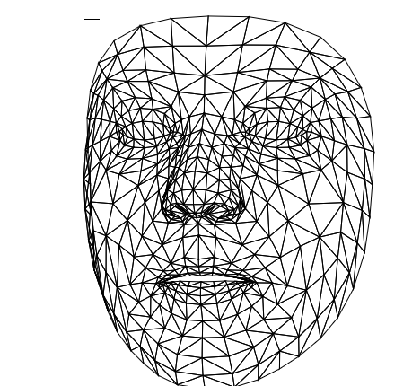
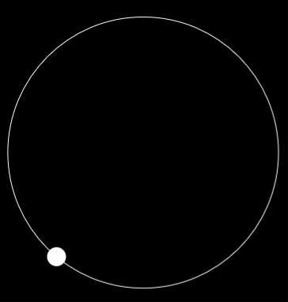
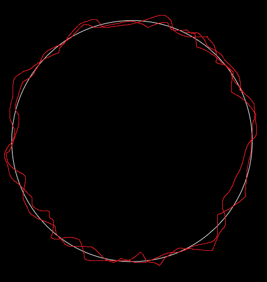
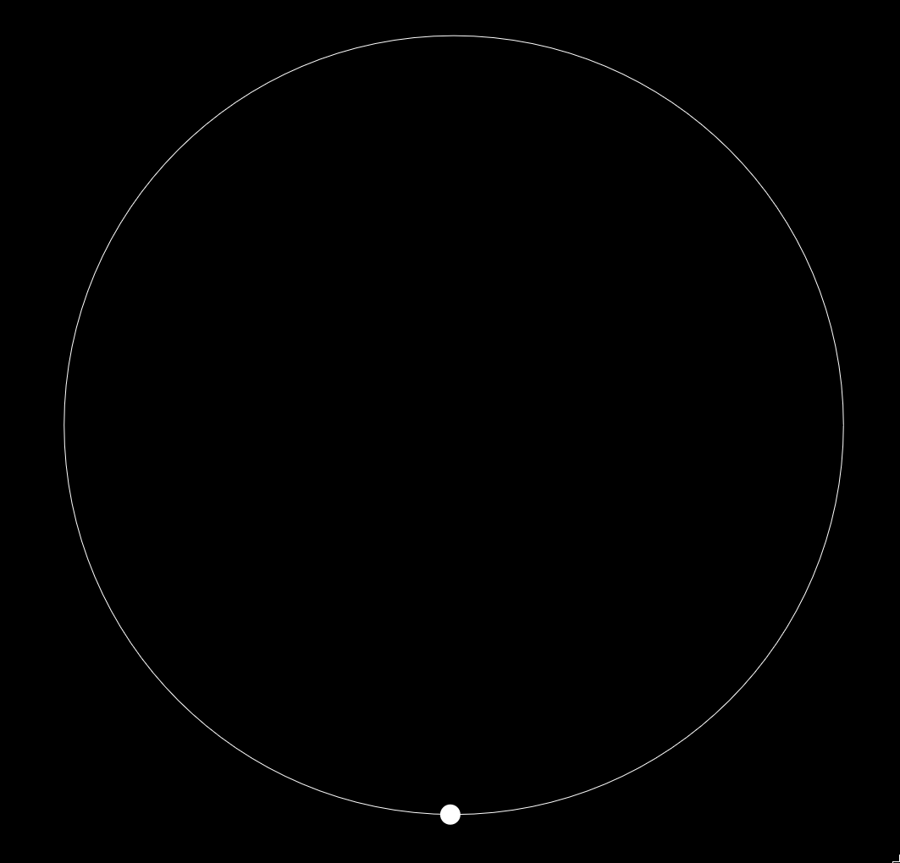

# Project Summary
This is an overview of the most relevant information related to the eye tracking project. Included are links to documentation, explanations of tools, diagrams of program workflows, and more.

## What is the project?
Our team has various research goals. First and foremost is developing eye movement data extraction tools. In short, this means that information about where a subject's eye is looking could be gathered with a simple commerical grade webcam. This would bring with it the potential for various applications such as developing new [brain-vision coordination](##Brain-Vision-Coordination) routines. And other applications could include studying UI/UX design, and studies focused on images such as our [medeival manuscript study](##Medeival-Manuscript-Study).

## Brain-Vision Coordination
The brain-vision coordination project seeks to benefit the medical field. Neuro-opthamologists can use eye tracking technology to aid in diagnosis of various neurological, visual, and motor conditions, as well as physical disorders affecting the eye. This project can be broken down into three distinct parts listed below.

### Data Aquisition
To acquire eye gaze data, this project will use [MediaPipe](###MediaPipe), a framework that allows us to collect 3-D spatial data for landmarks around the face (click left image). It also requires us to develop stimulus routines such as this revolving circle stimulus (click right image).

### Data Processing
The raw spatial geometry requires some processing to fit our needs. For example, we may want to remove frames where subjects are blinking from datasets. There are many more technical topics regarding data processing to be mentioned in other areas.

### Data visualization
After collecting data, it will need to be visualized in correspondence with what sort of stimulus was presented. Below is a sketch of what the visualiztion for the above stimulus may look like, where the red is the path that the user's eye followed.

<!--

This text will wrap around the image to the right. You can continue writing here, and the text will adjust to wrap around the image. Make sure the image size is small enough to allow space for the text to wrap.
-->
